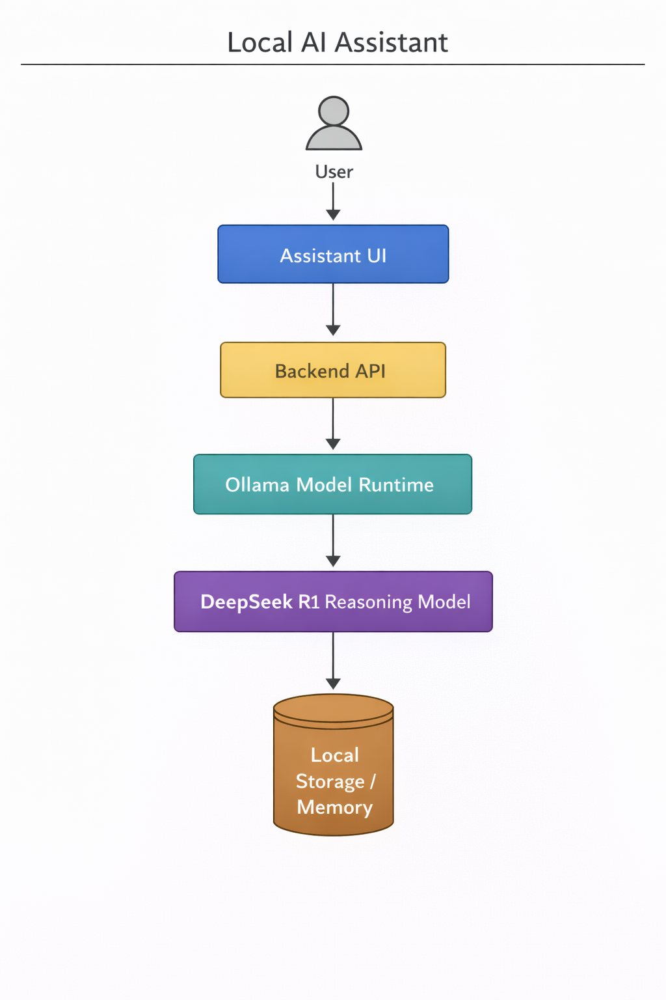

# Local AI Assistant

## Overview

A privacy-first AI assistant designed to run entirely on local infrastructure using open-source large language models.

This project explores how local AI systems can provide useful reasoning capabilities while eliminating the privacy and cost concerns associated with cloud-based AI services.

---

## Product Context

Most AI assistants rely on cloud APIs.

This introduces several challenges:

• Privacy concerns when sending sensitive data
• API costs at scale
• Latency due to remote inference

Local AI assistants allow organizations and individuals to run AI systems directly on their own machines.

---

## Target Users

• Developers working with private code
• Enterprises with strict data governance policies
• Offline environments
• Privacy-conscious users

---

## Product Hypothesis

A local-first AI assistant can deliver useful reasoning and productivity assistance while maintaining full control over user data.

---

## Core Capabilities

• Local LLM inference
• Chat-based AI assistant interface
• Modular architecture for workflows
• Persistent memory (future capability)

---

## Architecture

User
↓
Assistant UI
↓
Backend API
↓
Ollama Model Runtime
↓
DeepSeek R1 Reasoning Model
↓
Local Memory Store

---

## Architecture Diagram

  

---

---

## Product Tradeoffs

Local models provide strong privacy guarantees and lower operational costs but may have lower performance compared to large cloud-hosted models.

Designing useful local AI assistants requires balancing performance, latency, and resource usage.

---

## Product Roadmap

V1 — Local chat assistant

V2 — Persistent memory

V3 — Document ingestion

V4 — Autonomous task workflows
